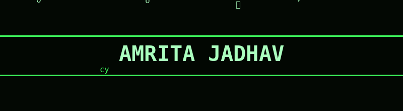

<div align="center">




</div>

---

### `$ cat about.txt`

```bash
> CSE student @ VIT Bhopal, specializing in Cybersecurity
> Security Analyst Intern @ ParshWebCraft — vulnerability assessments, OWASP Top 10, header hardening
> SOC Analyst enthusiast — into log analysis, threat detection & incident response workflows
> Building JWT auth systems, RBAC engines, IDS/IPS pipelines, and attack simulators
> Active on PortSwigger Web Security Academy & TryHackMe
> Currently targeting AppSec / Security Engineering / SOC roles
```

---

### `$ cat experience.log`

**Security Analyst Intern** — ParshWebCraft · Udaipur, India (Remote) `Jun 2026 – Present`

- Conducted a full security audit of the production site, uncovering **12 vulnerabilities** — exposed admin paths in robots.txt, missing HTTP security headers, clickjacking risk, unprotected contact form endpoints.
- Implemented rate limiting, honeypot fields, and CSP headers — stopped a bulk email spam attack flooding 100+ submissions/day.
- Flagged information-disclosure issues: scraped phone numbers, inconsistent emails, missing X-Frame-Options.
- Applied OWASP Top 10 principles across the attack surface — XSS, SQL Injection, Broken Access Control.
- Reviewed auth/authorization workflows and recommended hardening for API endpoints and form inputs.

---

### `$ ls ./projects`

<table>
<tr>
<td width="50%">

**🛡️ Multi-Layer Cloud Security Simulator**
Full-stack Defence-in-Depth simulator across IaaS/PaaS/SaaS — JWT + RBAC, firewall IP filtering, real-time SQLi/XSS detection dashboard.
`React` `Django REST` `SQLite` `JWT`
[`live_demo`](https://multi-layer-cloud-security-simulator-5ap6z40kr.vercel.app/) · [`source`](https://github.com/amritaa1603/Multi-Layer-Cloud-Security-Simulator)

</td>
<td width="50%">

**🕵️ Network Intrusion Detection System**
ML-based NIDS on CICIDS 2017 — classifies DoS, DDoS, Brute Force, Port Scan & Web Attacks. **98%+ accuracy** with Random Forest.
`Python` `Scikit-learn` `Pandas` `NumPy`
[`source`](https://github.com/amritaa1603/network-intrusion-detector)

</td>
</tr>
<tr>
<td width="50%">

**🔎 Web App Security Audit — ParshWebCraft**
Black-box assessment of a production Next.js site — found 12 vulns (admin path disclosure, missing CSP/HSTS/X-Frame-Options, exposed PII). Delivered a prioritized remediation report.
`OWASP Top 10` `Manual Testing` `HTTP Header Analysis`

</td>
<td width="50%">

**💊 More on GitHub →**
Check out my pinned repos for additional builds, including inventory & platform systems with a security-first mindset.
[`@amritaa1603`](https://github.com/amritaa1603)

</td>
</tr>
</table>

---

### `$ cat skills.json`

<p align="center">
  
  
  
  
  
</p>

<p align="center">
  
  
  
  
</p>

<p align="center">
  
  
  
  
  
</p>

<p align="center">
  
  
  
</p>

<p align="center">
  
  
  
  
</p>

---

### `$ ./run_stats.sh`

<p align="center">
  
  
</p>

<p align="center">
  
</p>

---

### `$ cat connect.sh`

<p align="center">
  <a href="mailto:amritajdhv16033@gmail.com"></a>
  <a href="https://www.linkedin.com/in/amrita-jadhav-3ba11728a/"></a>
  <a href="https://amrita1603-portfolio.vercel.app"></a>
</p>

<p align="center">
  
</p>

<p align="center">
  <sub>◤ ACCESS GRANTED — connection secured over TLS ◢</sub>
</p>
